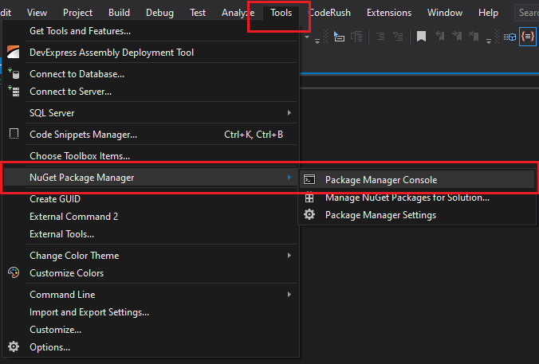
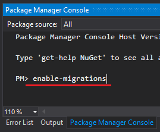
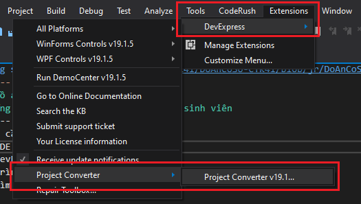

## Đồ án cơ sở - Windows Forms App
## Ứng dụng quản lý giải quyết học vụ sinh viên

### Yêu cầu:

- IDE Visual Studio
- DevExpress
- Trình độ sử dụng C# ở mức trung bình
- Tìm hiểu thêm về Entity Framework
- SQL Server * Management Studio

## Hướng dẫn

- Bạn trỏ đến `Tools -> NuGet Package Manager -> Package Manager Console`


- Sau đó trỏ xuống:


- Để kích hoạt migrations, bạn nhập:
```
PM> enable-migrations
```
- Sau đó bạn nhập:
```
PM> add-migration abc
```
- `abc` thì các bạn nhập tuỳ ý
- Cập nhật các table vào SQL Server:
```
PM> update-database -v
```

## Nếu gặp lỗi Call stack ở các Form

- Hãy trỏ đến `Extensions -> DevExpress -> Project Converter`


- Khi bảng Convert hiện lên, hãy nhấn `Upgrade All`

## Tài liệu tham khảo

- [FoxLearn](https://foxlearn.com) thiết kế Form với `DevExpress` và chuỗi bài giảng về `Entity Framework`, `Đăng nhập phân quyền`
- [HowKteam](https://www.howkteam.vn) chuỗi bài giảng về Cơ sở dữ liệu `SQL Server`
